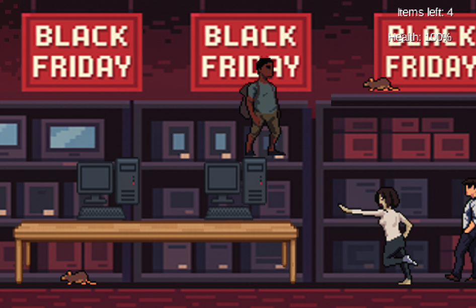

# 🛍️ Escape From Black Friday


**Escape From Black Friday** es un videojuego 2D estilo plataformas desarrollado en Java con la librería **libGDX**. En él controlas a un empleado de una tienda de electrónica que, tras acabar su turno en pleno Black Friday, debe escapar del caos esquivando clientes enfurecidos y recogiendo objetos personales antes de llegar a la salida.


## 🎮 Características

- Estilo visual **PixelArt**.
- Animaciones y sonidos integrados.
- Gestión de niveles y colisiones.
- NPCs con inteligencia básica (enemigos que patrullan y reaccionan al jugador).
- Guardado de configuración (volumen, música, efectos).
- Sistema de pausa e instrucciones dentro del juego.

Este proyecto fue desarrollado como parte de la asignatura **Programación Multimedia** del Ciclo Formativo de Desarrollo de Aplicaciones Multiplataforma.

## 🧪 Controles

- `→ / ←`: Mover al personaje.
- `↑`: Saltar.
- `ESC`: Pausar.

## 🛠️ Tecnologías utilizadas

- **Java 21**
- **libGDX**
- **Tiled** (para diseño de niveles)
- **VisUI** (para UI gráfica)

## 🎮 Capturas del juego 




# 🛠️ Instrucciones de Ejecución

## Clonar el repositorio

```bash
git clone https://github.com/tu_usuario/EscapeFromBlackFriday.git
cd EscapeFromBlackFriday
```

## Ejecutar el juego

Desde la raíz del proyecto, usa el siguiente comando:

```bash
./gradlew lwjgl3:run  
```
